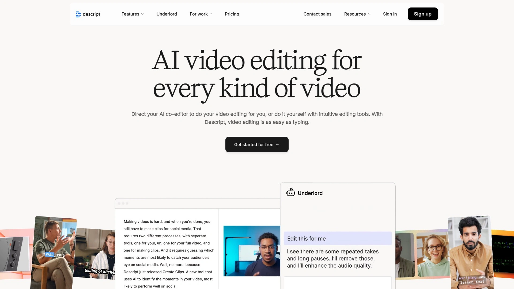

# 2025年你必须了解的18款顶级AI自动剪辑视频工具

看着别人的短视频动不动就几十万播放,你是不是也想试试?但一想到要坐在电脑前盯着剪辑软件好几个小时,就觉得头大。其实现在有一种更聪明的办法——让AI帮你干活。你只需要上传长视频,AI就能自动找到最精彩的部分,剪成适合TikTok、YouTube Shorts或Instagram Reels的短视频。这些工具不仅能省时间,还能帮你找到那些你可能错过的爆款瞬间。下面这份清单,是我整理的18款目前最好用的AI视频剪辑工具,每一款都有自己的绝活。

## **[AI Video Cut](https://www.aivideocut.com)**

一句话搞定视频剪辑的智能助手。

这款工具最大的特点是"提示词驱动剪辑"——你只需要输入一段文字描述,比如"把这个视频剪成产品广告"或者"提取演讲中的金句",AI就能按照你的要求自动完成剪辑。它支持100多种语言的转录,准确率高得吓人,而且人脸追踪功能会自动把说话的人保持在画面中心。最方便的是可以选择9:16、1:1或16:9等多种尺寸导出,一次剪辑就能适配所有平台。免费版提供50分钟的处理时长,足够你体验它的全部功能了。

**核心功能:**
- 自然语言提示词剪辑,说人话就能让AI理解你的需求
- 智能人脸追踪,自动保持主体居中
- 内置多种预设模板:病毒式短视频、产品广告、教学视频、搞笑片段等
- 文本编辑转录,直接修改字幕就能删除不需要的片段
- 支持从YouTube、Instagram、Zoom等多个平台直接导入视频

**适用场景:** 内容创作者需要快速从长视频中提取多个不同主题的短片段,或者营销团队想要批量生成不同风格的推广素材。

## **[OpusClip](https://www.opus.pro)**

让任何类型视频都能变成爆款的AI剪辑神器。

大多数AI剪辑工具只能处理访谈或播客这种"说话型"视频,但OpusClip的ClipAnything功能可以剪辑任何类型的内容——游戏直播、体育赛事、Vlog、教学视频,统统都能处理。它最厉害的地方是有一个"病毒潜力评分"系统,会告诉你每个片段在社交媒体上火起来的概率有多大。而且它的ReframeAnything功能可以自动追踪画面中的关键对象,即使视频被裁剪成竖屏格式,重点内容也不会被切掉。目前已经有1200万创作者和商家在用它。

你可以设置品牌模板,自动给输出的视频加上你的Logo、字体和配色,非常适合需要保持品牌统一性的团队。

## **[Vizard.ai](https://vizard.ai)**

一键生成30多个短视频片段的效率工具。

这个工具的AI会自动识别长视频中的精彩时刻,然后用一次点击就能把它们全部剪出来。特别适合那种一个小时的网络研讨会或播客录音,Vizard能从中提取出足够你发一个月的社交媒体内容。它的文本编辑模式让剪辑变得像改Word文档一样简单——删掉转录文本中的某句话,对应的视频片段也会自动消失。团队协作功能也很完善,可以直接生成链接分享给客户预览,不用下载。

**定价方式:** 提供免费试用,付费版按处理时长计费,比雇人工编辑便宜好几倍。

**技术亮点:** 支持100多种语言的字幕翻译,让你的内容一键覆盖全球市场。

## **[Pictory](https://pictory.ai)**

把文章和博客变成视频的创意工具。

如果你有一堆文字内容不知道怎么用,Pictory可以帮你把它们转化成视频。只需要粘贴博客链接或文章内容,AI就会自动选择相关的视觉素材、生成配音、添加字幕,最后输出一个完整的视频。它的场景识别功能会自动把内容分成不同段落,每个段落匹配合适的画面。特别适合那些想要把长篇内容重新包装成短视频的营销人员,不需要任何视频制作经验就能上手。

## **[Wisecut](https://www.wisecut.ai)**

专门对付"废话"的智能剪辑助手。

这个工具最擅长处理访谈、讲座、播客这类语音为主的内容。它会自动识别说话的部分,去掉所有沉默和停顿,让视频节奏变得紧凑。字幕生成的准确度超过97%,而且会根据语音的节奏自动调整视频的剪辑点,确保画面切换看起来很自然。如果你经常录制教学视频或采访,这个工具能把你的剪辑时间从几小时缩短到几分钟。

**价格:** 入门版每月10美元,提供8小时AI处理时长;专业版每月29美元,提供30小时处理时长。

## **[Munch](https://www.getmunch.com)**

用数据告诉你哪个片段会火的分析型工具。

Munch不只是剪视频,它还会分析当前社交媒体的热门趋势,找出你视频中最有可能爆火的片段。它的AI会根据TikTok、Instagram Reels和YouTube Shorts的算法特点,自动优化每个片段的长度、节奏和视觉效果。每个生成的片段都会附带一个"病毒潜力报告",告诉你这段内容在不同平台上的预期表现。价格稍贵,但对于需要精准投放内容的营销团队来说物超所值。

## **[Descript](https://www.descript.com)**

像编辑文档一样编辑视频的革命性工具。

Descript把视频编辑变成了打字工作。它会把视频转录成文本,你只需要在文本编辑器里删改文字,视频就会自动跟着变化。如果你说错了什么,可以直接在转录文本里改掉,AI会用你的声音重新生成正确的语音——听起来就像你亲自重新录制的一样。它还有自动去除"嗯"、"啊"等口头禅的功能,一键就能让你的视频听起来更专业。

**适合人群:** 播客主持人、教育工作者、企业培训师等需要频繁制作语音类内容的人。

## **[Vidyo.ai](https://vidyo.ai)**

把长视频拆成多个爆款短片的拆解专家。

这个平台特别擅长从一个长视频里提取多个不同角度的短片。比如你录了一场两小时的直播,Vidyo.ai可以从中剪出十几个独立的片段,每个都有完整的故事结构。它会自动添加字幕、Logo,还能按照不同平台的要求调整画面比例。对于那些想要"一鱼多吃"、把同一内容发布到多个平台的创作者来说,这个工具能节省大量时间。

## **[InVideo AI](https://invideo.io)**

从零开始生成完整视频的智能创作平台。

如果你连原始素材都没有,InVideo AI可以根据你的文字提示从头生成视频。你只需要描述想要什么内容,它就会自动写脚本、选择素材、配音、加字幕,几分钟后就能给你一个完整的视频。它的素材库非常丰富,而且AI生成的配音听起来非常自然,支持多种语言和口音。特别适合需要快速制作大量内容但没有视频拍摄条件的人。

**缺点:** 免费版导出的视频会有水印,需要付费去除。

## **[CapCut](https://www.capcut.com)**

背靠抖音的强大编辑工具。

作为TikTok母公司字节跳动推出的剪辑工具,CapCut天生就懂短视频的门道。它的AI功能包括自动配乐、智能卡点、一键美颜等,而且有大量抖音风格的特效模板可以直接套用。虽然不是完全自动化,但它的辅助功能做得非常好,能让不会剪辑的人也能做出有创意的视频。最关键是完全免费,没有水印。

## **[Short AI](https://www.short.ai)**

批量生成无脸视频的效率怪兽。

这个工具专门为无脸频道设计,可以自动生成AI故事视频、Reddit故事视频、假聊天记录视频等热门内容类型。它最大的优势是可以一次生成10个以上的短视频,而且内置定时发布功能,可以自动把内容发布到TikTok、YouTube、Instagram等多个平台。如果你想运营一个自动化的短视频频道,这个工具能让你真正实现"睡着也能涨粉"。

## **[Spikes Studio](https://www.spikes.studio)**

专为游戏和体育视频优化的剪辑工具。

Spikes Studio的AI特别擅长识别游戏直播和体育比赛中的精彩瞬间——击杀、得分、反转等。它会自动找到这些高光时刻,添加流畅的转场,还能根据情绪调整剪辑节奏。对于游戏主播和体育内容创作者来说,这个工具能帮你快速把几个小时的直播录像变成十几个可以发布的精彩片段。

**技术特点:** 支持Twitch、YouTube Gaming等平台的直接导入。

## **[AutoShorts.ai](https://autoshorts.ai)**

全自动运营TikTok和YouTube频道的懒人神器。

这个平台的目标是让你完全不用动手就能运营一个短视频频道。它可以自动生成内容、自动剪辑、自动添加字幕和特效,甚至可以自动发布。你只需要设置好主题和发布频率,剩下的事情全部交给AI。虽然生成的内容可能不如人工制作的有创意,但对于想要批量运营多个频道的人来说,这个工具能让你用一个人的时间管理十个账号。

## **[Runway ML](https://runwayml.com)**

面向专业创作者的AI视频实验室。

Runway不仅能剪辑视频,还能生成视频、修改视频内容、添加特效。它的AI模型非常先进,可以做到一些其他工具做不到的事情——比如把静态图片变成动态视频,或者改变视频中的天气和光线。虽然学习曲线比其他工具陡一些,但它给创作者提供的控制权也更大。适合那些想要探索AI视频创作边界的专业人士。

## **[Synthesia](https://www.synthesia.io)**

用AI虚拟人代替真人出镜的未来工具。

如果你不想露脸,又想做出有真人出镜效果的视频,Synthesia是个完美选择。它提供230多个AI虚拟人,支持140多种语言,你只需要输入文字脚本,AI就能生成一个虚拟人说这段话的视频。特别适合企业培训、产品介绍、多语言内容制作等场景。虽然价格不便宜,但比雇演员和摄影师便宜多了。

**应用场景:** 跨国公司的内部培训视频、多语言产品演示、教育课程等。

## **[Magisto](https://www.magisto.com)**

被Vimeo收购的智能故事编辑器。

Magisto的AI会分析你的视频素材,理解内容的情绪和节奏,然后自动组装成一个有故事感的作品。它会自动添加转场、特效和背景音乐,让视频看起来像是专业编辑制作的。特别适合需要快速制作品牌视频的营销人员,可以设置自定义品牌元素确保视频风格统一。

**定价:** 高级版每月4.99美元,专业版每月9.99美元还附赠Vimeo Pro账号。

## **[Lumen5](https://lumen5.com)**

把博客文章变成社交媒体视频的转化专家。

Lumen5的AI会读取你的文章内容,自动提取关键点,然后为每个要点匹配合适的视觉素材。它有一个庞大的媒体库,可以根据文章主题自动选择图片和视频片段。整个过程非常自动化,你只需要做最后的微调就能得到一个适合在社交媒体发布的视频。对于有大量文字内容需要重新利用的博主和媒体来说,这是个省时省力的工具。

## **[Canva AI视频生成器](https://www.canva.com)**

设计师熟悉的Canva推出的视频AI功能。

如果你已经在用Canva做图片设计,那么它的AI视频功能可以无缝融入你的工作流程。你可以用文字提示生成视频,或者上传自己的片段用AI工具快速编辑。它有自动裁剪、高光识别、字幕生成等功能,而且可以直接使用你在Canva品牌工具包里设置的颜色、字体和Logo。最大的优势是整个团队可以实时协作,每个人都能看到最新的修改。

## 常见问题

### 这些AI剪辑工具真的能替代人工编辑吗?

对于大部分常规内容来说,AI工具已经能做到80%的工作——自动找精彩片段、加字幕、调整画面比例这些都不在话下。但如果你需要很强的创意表达或者复杂的叙事结构,人工编辑还是更靠谱。最好的方式是让AI先做粗剪,人再做精修,这样能把效率提升好几倍。

### 我该选择哪个工具?

如果你主要做访谈或播客,**Wisecut**和**Descript**最合适;如果需要处理各种类型的视频,**OpusClip**的ClipAnything功能最强大;如果想要完全自动化运营频道,**AutoShorts.ai**和**Short AI**可以帮你实现。预算有限就选**CapCut**或**Canva**,它们免费功能就很强大。

### 这些工具生成的视频会不会被平台判定为低质量内容?

只要你用的是原创素材,平台一般不会因为使用AI剪辑就降低推荐。关键是内容本身要有价值——AI只是工具,它能帮你提高效率,但不能帮你创造价值。很多大号都在用这些工具,只是他们不会告诉你而已。

## 结语

从手工剪辑到AI自动化,视频制作的门槛已经降到了历史最低点。这18个工具各有特点,但如果你刚开始尝试短视频制作,我建议从**[AI Video Cut](https://www.aivideocut.com)**开始——它的提示词功能让你可以用最自然的方式告诉AI你想要什么,而且免费额度足够你搞清楚自己到底需要什么功能。等你熟悉了整个流程,再根据具体需求选择其他专业工具。记住,工具只是帮你节省时间,真正决定视频质量的还是你的内容本身。
